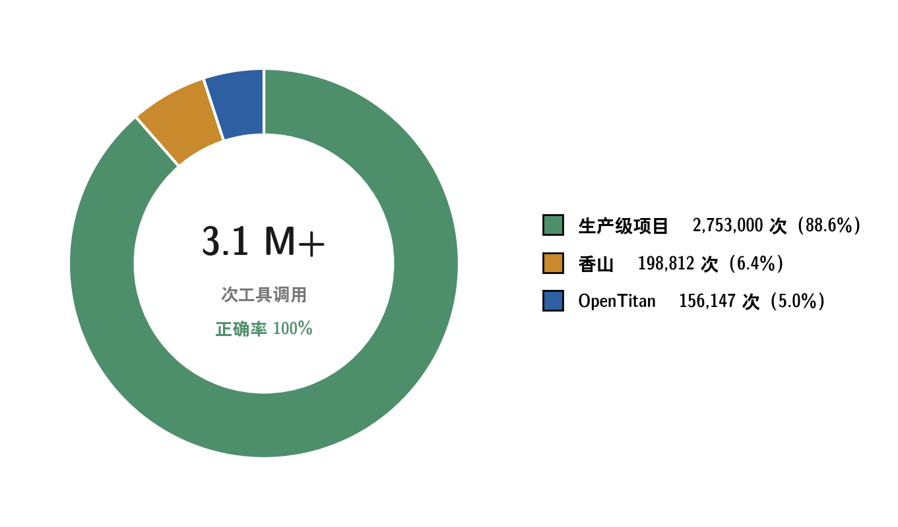

# wave-mcp：开源、免 License 的 RTL 波形调试 MCP Server


[](https://pypi.org/project/wave-mcp/)
[](https://pypi.org/project/wave-mcp/)
[](LICENSE)

[English](README.en.md) | 简体中文

**wave-mcp 是腾讯蓬莱实验室验证团队开源的一款 RTL 波形调试 MCP Server**，为 LLM 提供波形调试工具集：
读 **FST 波形 + RTL 网表**，提供层次探索、信号查询、驱动分析、值/X 态追踪、波形对比与浏览器波形查看器等 **31 个 MCP 工具**。
**MIT 开源，无需任何商用 License，支持任意并发。**

> 只要你的仿真器能 dump **FST**（Verilator `--trace-fst`、Icarus，或把 VCD 转 FST），
> wave-mcp 就能读它做调试。它**不跑仿真器**，你用自己的流程跑出波形，把结果交给它即可。

---

## 为什么是 wave-mcp

芯片验证占据开发周期 50% 以上的时间，波形调试是其中最高频的动作。而 LLM 时代，
工程师希望让 AI Agent 直接读波形、查信号、追 X 态根因，但市面上的商用调试
MCP 需要昂贵的 License，且并发受限。

wave-mcp 用**纯开源技术栈**（pylibfst + pyslang）提供完整波形调试能力：
**免 License、数据准确、真实芯片项目背书**。

## 生产级验证

在**真实生产级芯片项目**（几十个模块）上完整验证，并把 OpenTitan、香山纳入测试集：


| 维度 | 结果 |
| --- | --- |
| 测试规模 | **一百多个测试 case**（生产级项目 + OpenTitan 27 个 IP + 香山 38 个 IP） |
| 数据准确性 | **225 万信号级验证，值查询正确性 100%** |
| 工具调用 | 310 万多次调用全部通过 |
| 驱动分析 | 驱动 / 扇入 / 连通 / 追溯在生产级项目上全量验证 |
| 超大模块 | **百万级 scope 稳定完成分析** |
| 工具覆盖 | 27 个分析工具全部实测；viewer/diff 4 个新工具由 113+ 项单元与浏览器端到端断言覆盖 |



## 特性

- **波形查询**：设计层次、实例、信号（位宽/方向/类型，含总线聚合）、信号值（点查询 / 区间，随机访问）。
- **静态分析（pyslang 网表）**：连接、驱动、扇入/扇出、声明位置（文件:行号）。
- **无波形静态分析**：`open_static_session` 只凭 RTL 源码建 session，**仿真前即可分析设计结构**。
- **值追踪**：`trace_value` 沿驱动链反向遍历、可跨模块下钻，每个节点带真实 FST 值；`trace_x` 追 X 根因。
- **网表自愈**：从 pyslang 诊断自动补 `+incdir+` / 包源并重编；失败时优雅降级，其余工具不受影响。
- **一致性校验**：源码或波形变了但网表没更新会报警，绝不静默给错结果。
- **部署友好**：stdio（一人一进程，零运维）/ HTTP 多会话 / 离线自包含包（隔离网）。

## 系统要求

| 依赖 | 版本要求 | 说明 |
| --- | --- | --- |
| Python | **3.10 – 3.13** | 已测 3.10–3.13 全部通过；mcp SDK 要求 ≥ 3.10 |
| glibc | **≥ 2.28** | pyslang 预编译 wheel 的要求（对应 Ubuntu 18.10+ / Debian 10+ / CentOS 8+） |
| mcp | **2.x**（`>=2.0.0,<3`） | MCP SDK v2，`pip install` 自动安装 |
| pylibfst | **≥ 0.2.1** | FST 波形读取（fstapi，随机访问） |
| pyslang | **≥ 11.0.0** | RTL 网表构建（完整 elaboration） |
| vcd2fst（可选） | GTKWave | 仅 VCD→FST 转换需要（`apt install gtkwave` / `brew install gtkwave`） |
| Verilator（示例） | ≥ 5 | 仅 `verilator_quickstart` 示例需要 |

> 操作系统 **Linux x86_64 开箱即用**（以上 Python 依赖均有预编译 wheel）。
> macOS / Windows / arm64 因 `pylibfst` 暂无预编译 wheel，需源码编译（cmake+gcc+zlib）。
> 隔离网 / 离线环境见 [`docs/DEPLOY_AIRGAP.md`](docs/DEPLOY_AIRGAP.md)。
> **目标机 Python < 3.10（如 3.6–3.9）或无 Python**：无需升级目标机，打离线 bundle 时用
> `--python` 捆绑独立 Python 3.11 即可，见 [`docs/DEPLOY_AIRGAP.md`](docs/DEPLOY_AIRGAP.md) 第 7 节。
> **glibc < 2.28（如 CentOS 7 / RHEL 7，glibc 2.17）**：`pip install` 路径不可用（官方
> `pyslang` wheel 要求 manylinux_2_28，pip 会退化为源码编译且几乎必然失败）。两个选择：
> ① 在容器中运行（如 `python:3.11-slim`）或升级系统；② 用离线 bundle 的
> `--target-glibc 2.17` 打包（自编 pyslang 兼容 wheel，支持 glibc ≥ 2.17），
> 见 [`docs/DEPLOY_AIRGAP.md`](docs/DEPLOY_AIRGAP.md) 第 1c 节（注意：pyslang 每次升级都需重编该 wheel）。

---

## 快速开始

### 1. 安装

```bash
pip install wave-mcp
```

### 2. 跑一个示例

```bash
# 示例 A：Verilator 快启（counter 设计，产真实 FST，无需商用仿真器）
python examples/verilator_quickstart/run.py      # 需 verilator>=5

# 示例 B：静态分析（UART 设计，无需波形、无需仿真器，展示仿真前分析）
python examples/static_analysis/run.py

# 示例 C：极小内置样例（手写 VCD → vcd2fst → FST，零依赖）
python examples/make_sample.py
```

### 3. 打开你的波形

```bash
# 一条命令：波形(.fst/.vcd) + filelist → session（自动转 FST + 建网表）
wave-session --fst sim/dump.fst --top top_tb --filelist rtl.f --out sessions/my_module

# 启动 MCP Server（stdio，推荐：一人一进程）
python -m wave_mcp.server --session sessions/my_module
```

或者在你的 Code Agent 里直接用 MCP 工具 `prepare_session`，见下文集成示例。

## CLI 模式

不挂 Code Agent 时，也能在终端直接调用全部 31 个工具（与 MCP 同名同参数）：

```bash
wave-mcp query --list                            # 列出全部 31 个工具

wave-mcp query signal_values --session sessions/my_module \
    --full_path top.u_tx.tx_serial              # 查询信号值变化

wave-mcp query signal_drivers --session sessions/my_module \
    --json-args '{"full_path": "top.u_tx.tx_serial"}'   # JSON 传参
```

- 参数按工具签名自动生成，`wave-mcp query <工具名> --help` 查看
- 默认输出人读文本，加 `--json` 输出完整结构化结果
- 适合 CI 脚本、开发调试、快速验证；每次新增工具自动获得 CLI 接口

## Code Agent 集成

`prepare_session` 是 MCP 统一入口，Code Agent 想分析波形时**第一步调它**，
传入仿真产出的波形，一次完成"（转换 →）建网表 → 建 session → 打开"：

```jsonc
prepare_session({
  "out_dir":      "sessions/my_module",
  "wave_path":    "sim/dump.fst",          // .fst 直读 / .vcd 自动转
  "top":          "top_tb",
  "filelist_path":"rtl.f",                 // 与仿真同一份 filelist
  "mode":         "speed"                  // VCD->FST：speed/balanced/size
})
// 返回 ready 后即可调 signal_values / list_child_instances / signal_drivers ...
```

**接入配置**（stdio，各家 Agent 的 MCP 配置）：

```json
{
  "mcpServers": {
    "wave-mcp": {
      "command": "python",
      "args": ["-m", "wave_mcp.server", "--session", "/abs/path/to/sessions/my_module"]
    }
  }
}
```

- **Claude Code**：写入 `.mcp.json`（`claude mcp add` 或手工配置）
- **Cursor**：写入 `.cursor/mcp.json`
- **VS Code Copilot**：写入 `.vscode/mcp.json`
- 其余 Agent（Gemini CLI / Qwen Code / OpenHands 等）：按各自的 `mcpServers` 配置填入上述 JSON 即可

### 无波形静态分析（仿真前即可用）

波形里有值，没有连接关系：信号这一拍是 0，波形本身回答不了它被谁驱动、驱动语句又被什么
条件门控。wave-mcp 在建 session 时就把这层关系从 RTL 源码里提出来：pyslang 完整精化
（参数、generate、interface 全展开）后持久化成一份**静态设计数据库**，驱动、扇入扇出、
连通、声明查询都跑在这份库上，不依赖仿真器，也不依赖任何商用工具。

`open_static_session` 只凭 RTL 源码建网表并打开 session，**不需要任何波形、不跑仿真**。
适合仿真前理解代码：查接口、查驱动/扇入扇出、浏览层次、做 code review。

```jsonc
open_static_session({
  "out_dir":      "sessions/my_module",
  "top":          "uart",
  "filelist_path":"rtl.f"
})
// 连接/驱动/层次/文件/声明类工具全部可用；值/追踪类工具返回明确的 "needs waveform" 提示
```

之后仿真产出波形时，用**同一个 out_dir** 调 `prepare_session` 升级为完整 session，已建好的网表直接复用。

每条驱动记录都带完整语境：驱动类型、源码位置、语句片段、右值来源、以及压在这条语句上的
**全部门控条件**（可 4 值求值的表达式树）。以示例 B 的 UART 为例：

```yaml
# wave-mcp query signal_drivers --session ... --full_path uart_top.u_tx.tx_serial
drivers:
  - kind: nonblocking
    file: examples/static_analysis/uart_top.sv
    line: 91
    snippet: tx_serial <= shift_reg[0];
    rhs: uart_top.u_tx.shift_reg
    control: uart_top.u_tx.state, uart_top.u_tx.tick, ...
    guard:                          # 这条语句头上压着的全部条件
      - {cond: !rst_n, expect: 0}
      - {cond: tick, expect: 1}
      - {cond: state == DATA, expect: 1}
```

有了波形后，`active_drivers` 用 FST 值对 guard 做 4 值求值，直接告诉你**某一拍是哪条驱动
语句在起作用**；`trace_value` / `trace_x` 沿这张图反向遍历、跨模块下钻，每个节点带真实
波形值。静态连接关系与动态波形值在同一套工具里打通，这是纯静态设计数据库给不了的。

**驱动分析与追踪是按生产级健壮性打磨的**，不是 demo 功能：

- **真实项目全量验证**：驱动/扇入/连通/追溯在生产级芯片项目上全量验证，并以 OpenTitan
  27 个 IP + 香山 38 个 IP 按子模块层次逐一穷尽测试，功能正确性交叉验证超 1100 万项
  （file/line 真实存在、drivers↔loads 对称、trace 树结构合法等，而非仅"返回非空"）。
- **精化失败不掀桌**：单个 top 精化失败（如 UVM 环境拉不到 uvm_pkg）只影响该 top，
  健康 DUT 的网表照常提取；缺 `+incdir+`/包源时从 pyslang 诊断自愈重编；仍失败则明确
  降级，值查询等其余工具不受影响，绝不静默给错结果。
- **部分网表也可用**：诊断有 error 但仍提取出模块时，以 `partial` 标志照常服务，
  `session_info` 的 netlist_health 如实上报覆盖率，让你知道答案的可信边界。

### VCD → FST 转换（vcd2fst 配置，可选）

如果你的仿真器只吐 VCD（如 Questa），建议先转 FST：**体积约 VCD 的 1/50，随机访问快**。
Xcelium (xrun) 用户推荐跳过 VCD，用 fstdumper 插件直接 dump FST，见
[Xcelium 直出 FST 指南](docs/XCELIUM_FST_GUIDE.md)。
转换依赖 GTKWave 附带的 `vcd2fst` 工具：

```bash
# Debian/Ubuntu
sudo apt install gtkwave
# macOS
brew install gtkwave
```

> **已有 FST 则完全不需要 vcd2fst**（如 Verilator `--trace-fst` 直接 dump FST）。
> 隔离网环境可用离线 bundle（自带 vcd2fst），见 [`docs/DEPLOY_AIRGAP.md`](docs/DEPLOY_AIRGAP.md)。

三个转换入口：

```bash
# ① 独立转换（后处理）：mode=speed(fastlz,最快) / balanced(lz4) / size(zlib,最小)
wave-vcd2fst --vcd sim/dump.vcd --fst sim/dump.fst --mode speed

# ② 流式转换：把转换时间藏进仿真时间，仿真结束 FST 几乎同时就绪
wave-vcd2fst --stream --vcd sim/dump.vcd --fst sim/dump.fst
#   建 FIFO + 后台起 vcd2fst，然后 TB 里 $dumpfile("sim/dump.vcd") 指向该 FIFO 正常跑仿真

# ③ 建 session 一步到位（自动转 + 打包）
wave-session --vcd sim/dump.vcd --top top_tb --filelist rtl.f --out sessions/mod
```

> 通过 MCP 工具使用时无需手动转换：`prepare_session` 传入 `.vcd` 会自动走 ① 的转换路径。

---

## 工具（31 个，10 大类）

| 类别 | 工具 | 说明 |
| --- | --- | --- |
| 波形准备 | `prepare_session` / `open_static_session` / `convert_vcd_to_fst` | 波形入口 → session 一条龙；静态分析无需波形；不跑仿真器 |
| 会话管理 | `open_session` / `close_session` / `session_info` | `session_info` 含 netlist_health + definition_coverage |
| 层次探索 | `list_child_instances` / `list_modules` / `instances_of_module`(`_matching`) / `scope_info` | 模块定义名三层解析：网表 → 命名推断 → 手工 scope_map |
| 信号查询 | `list_signals` / `signal_info` | 位宽/方向/类型来自 FST（含总线聚合）；声明位置来自网表 |
| 值查询 | `signal_values` / `signal_values_in_range` / `signal_value_at` | FST 强项，随机访问 |
| 驱动分析 | `signal_connectivity` / `signal_drivers` / `signal_loads` / `signal_fanin` / `active_drivers` / `driver_contributors` | pyslang 网表（静态精确）+ 分支条件 4 值求值选活跃驱动 |
| 值/X 态追踪 | `trace_value` / `trace_x` | 网表 × FST 值反向遍历，跨模块下钻 |
| 波形对比 | `diff_waveforms` | pass/fail 双波形首分歧定位：首分歧时刻 + 分歧信号排序 + 时钟对齐采样滤毛刺；分歧信号直接接 `signal_fanin`/`active_drivers` 做因果回溯 |
| 波形查看器 | `open_wave_view` / `update_wave_view` / `get_view_state` | agent 分析完自动弹浏览器波形：嫌疑信号 + 游标钉出错时刻 + 分析说明弹窗；双波形对比视图 lockstep 联动；`get_view_state` 让 agent 感知用户当前看什么（对话式双向调试） |
| 文件 | `list_files` / `find_files` / `modules_in_file` | filelist + pyslang 网表 |

> 驱动分析与追踪类需要 pyslang 网表建成（`prepare_session` 时给对 filelist/incdirs/defines）。
> 查看器类需要安装可选资产包：`pip install wave-mcp[viewer]`（Surfer WASM + surver，EUPL-1.2 独立分发，核心包保持 MIT）；未安装时相关工具优雅降级返回提示，分析工具不受影响。

### 波形查看器（wave-view）

```bash
# 打开单个波形（几十 GB 的 FST 也是秒开：surver 服务端流式，浏览器按需取数据）
wave-view dump.fst --signals top.u_dma.req_valid --cursor 1523400ps

# 双波形对比视图（上下两个 pane，缩放/游标 lockstep 联动）
wave-view pass.fst fail.fst --labels pass fail
```

- 命令行打印 URL；桌面环境自动开浏览器，SSH/code agent 场景 IDE 终端自动转发端口点开即看。
- agent 典型闭环：case 挂了 → `diff_waveforms(pass, fail)` 定位首分歧 → `signal_fanin` 回溯根因 → `open_wave_view` 双波形 + 分歧 marker + 分析说明弹窗一次呈现。
- 分析说明是可收起的 log 弹窗，说明里的时刻引用（如 `[85000ps](#t=85000ps)`）点击即跳游标，游标/视口/marker 更新为无闪刷新。

---

## 示例库

| 示例 | 路径 | 依赖 | 展示内容 |
| --- | --- | --- | --- |
| Verilator 快启 | `examples/verilator_quickstart/` | Verilator 5+ | counter 设计 → 真实 FST → prepare_session 全流程 |
| 静态分析 | `examples/static_analysis/` | 无（纯 Python） | UART 设计无波形分析：层次/驱动/扇入/声明 |
| 极小样例 | `examples/make_sample.py` | 可选 vcd2fst | 手写 VCD → FST → session 冒烟 |

---

## 部署模式

- **stdio（推荐）**：每人本地起一个 Server 子进程，只加载自己模块的 FST+网表，零运维。
- **HTTP + 多 Session**：一个常驻服务，用 `session_id` 给每用户分隔离会话。
  `python -m wave_mcp.server --transport http --host 0.0.0.0 --port 8000`
- **隔离网 / 离线自包含包**：有网机器一键打包，拷贝到隔离网离线安装，自带独立 Python + 全部 wheel + 可选 vcd2fst：

  ```bash
  # ① 有网开发机：一键打包（可选 --python <独立Python包> --vcd2fst <二进制>）
  deploy/build_offline_bundle.sh --out /tmp/wave-mcp-bundle

  # ② 隔离网共享盘：解压后离线安装（无需联网/编译）
  tar -xzf wave-mcp-bundle.tar.gz -C /shared/ && cd /shared/wave-mcp-bundle
  ./install.sh --prefix /shared/wave-mcp      # 产出 bin/wave-mcp 启动器
  ```

  详见 [`docs/DEPLOY_AIRGAP.md`](docs/DEPLOY_AIRGAP.md)（含 vcd2fst 兼容性方案与排错）。

## FAQ

**Q1：为什么不支持 FSDB 和 SHM？**
FSDB 和 SHM 是闭源波形格式，读取详细数据绕不开商用工具，license 成本较高，
难以支撑未来 AI Agent 深度融入工作流后产生的高并发、海量波形分析需求。
wave-mcp 走 FST + VCD 开源路线，正是为成千上万条波形的并发分析场景提供高性能的开源替代方案。
FSDB 的支持（转换为 FST）已在规划中。SHM 不在计划内：Cadence Xcelium 用户
推荐直接从仿真源头产出 FST（免 license、零转换），见
[Xcelium 直出 FST 指南](docs/XCELIUM_FST_GUIDE.md)。

**Q2：需要商用 License 吗？**
不需要。MIT 开源，任意并发、不限机器数。这也是它区别于商用调试 MCP 的核心点。

**Q3：支持哪些仿真器？**
任何能产出 FST 或 VCD 的仿真器：Verilator（`--trace-fst`）、Icarus（`-fst`）、
Xcelium（[fstdumper 直出 FST](docs/XCELIUM_FST_GUIDE.md)）、VCS（VCD 转换）等。
wave-mcp 不跑仿真器，只消费你已产出的波形。各仿真器的获取 FST 方式与
验证状态详见 [仿真器兼容性说明](docs/SIMULATOR_COMPATIBILITY.md)。

**Q4：数据准不准？**
准。在真实生产级芯片项目上做了 225 万信号级验证，值查询正确性 100%；
层次与文件类工具（`scope_info` / `find_files` / `modules_in_file`）32/32 模块验证通过。

**Q5：没有波形也能用吗？**
能。`open_static_session` 只凭 RTL 源码做静态分析（仿真前可用），这是 wave-mcp 的独有能力。

**Q6：支持 macOS / Windows 吗？**
Linux x86_64 开箱即用。macOS / Windows / arm64 因 `pylibfst` 无预编译 wheel 需源码编译，
见[系统要求](#系统要求)。

**Q7：大波形性能如何？**
FST + C 系读取库（pylibfst）+ 进程常驻 + 随机访问，契合 AI 点查询场景；
实测百万级 scope 的超大模块稳定完成分析。

**Q8：怎么接入我的 Code Agent？**
见 [Code Agent 集成](#code-agent-集成)，一段 `mcpServers` JSON 即可。

**Q9：目标机器只有 Python 3.8 / 3.9（隔离网 / 加密环境），能用吗？**
能，不需要升级目标机。打离线 bundle 时用 `--python` 捆绑独立 Python 3.11
（python-build-standalone），安装时优先使用捆绑解释器，与系统 Python 完全无关。
原生支持 3.8/3.9 不可行：`mcp` SDK 硬性要求 ≥ 3.10，官方 `pyslang` wheel 不发 cp38，
且两版本均已 EOL。详见 [`docs/DEPLOY_AIRGAP.md`](docs/DEPLOY_AIRGAP.md) 第 7 节（旧环境 QA）。

**Q10：CentOS 7 / glibc 2.17 上报 `GLIBC_2.27' not found` 怎么办？**
官方 pyslang wheel 要求 glibc ≥ 2.28。先用 `deploy/build_pyslang_manylinux2014.sh`
自编兼容 wheel，再以 `--target-glibc 2.17 --pyslang-wheel <wheel>` 打 bundle，
整条链路（独立 Python + wheel + vcd2fst）在 glibc ≥ 2.17 均可运行。
详见 [`docs/DEPLOY_AIRGAP.md`](docs/DEPLOY_AIRGAP.md) 第 1c 节与第 7 节。

---

## 架构

```
仿真器 → dump 波形(FST) → wave-mcp Server(多数据源聚合) → LLM 客户端(MCP)
                              ↑
              FST 波形 + pyslang RTL 网表
```

| 数据源 | 实现 | 能力 |
| --- | --- | --- |
| `fst_source.py` | `pylibfst`（fstapi，随机访问）+ 总线聚合 | 层次探索、信号、信号值 |
| `netlist/` + `rtl_source.py` | **pyslang**（完整 elaboration）+ FST | 连接、驱动、扇入扇出、trace、文件/声明 |
| `netlist/name_infer.py` | 实例名 → 模块定义名命名推断 | 网表未覆盖时兜底补全 module_type |

一个 **session** = 一个隔离的调试上下文（一人一模块），由 `session.json` 绑定数据源。

## 实现要点

- **不用朴素解析大 VCD**（慢、易 OOM）；走 **FST + C 系读取库 + 进程常驻 + 随机访问**。
- **网表离线一次精化、落盘复用**：pyslang 精化结果持久化为 `netlist/maps.json`
  （DriverMap/FanInMap/LoadMap/LocMap + instance_tree），一个纯 JSON 文件，任何脚本可读。
  启动即加载，不每次重建；源码未变不重跑精化，静态 session 升级为波形 session 时同一份
  网表直接复用（新旧判断基于源文件 mtime）。
- **生成产物集中在 session 目录**：`prepare_session` 只向你指定的 `out_dir` 写入
  `session.json`（清单 + 指纹）、`netlist/maps.json`（网表），以及仅当输入是 VCD 时
  转换出的 `.fst`。分析查询全程在内存进行，不落盘任何索引或缓存，也不改动 RTL 源码
  和原始波形所在目录；删掉 session 目录即完成全部清理。
- **MCP 返回**：`structuredContent`（机器可读）+ `content[].text` 人读文本。

## 开源协议

本项目以 **MIT** 许可发布（见 [`LICENSE`](LICENSE)）。依赖均为宽松许可（MIT/BSD），
无 copyleft 传染；离线包附带的 `vcd2fst` 转换器由 GTKWave MIT 源码构建。
详见 [`docs/THIRD_PARTY.md`](docs/THIRD_PARTY.md)。

## 目录结构

```
wave_mcp/
  server.py              # MCP server，注册全部 27 工具
  session.py             # Session / session.json / 指纹校验 / 三层 definition_name
  pipeline.py            # prepare_session / prepare_static_session 编排
  sources/               # fst_source + rtl_source
  netlist/               # slang_netlist / trace_engine / expr_eval / name_infer
  cli/                   # wave-session / wave-vcd2fst
deploy/                  # 离线 bundle 构建 + 安装
examples/                # 示例库（见上表）
tests/                   # 回归套件 run_regression.py
docs/                    # DEPLOY_AIRGAP / SIMULATOR_COMPATIBILITY / XCELIUM_FST_GUIDE / THIRD_PARTY
```
