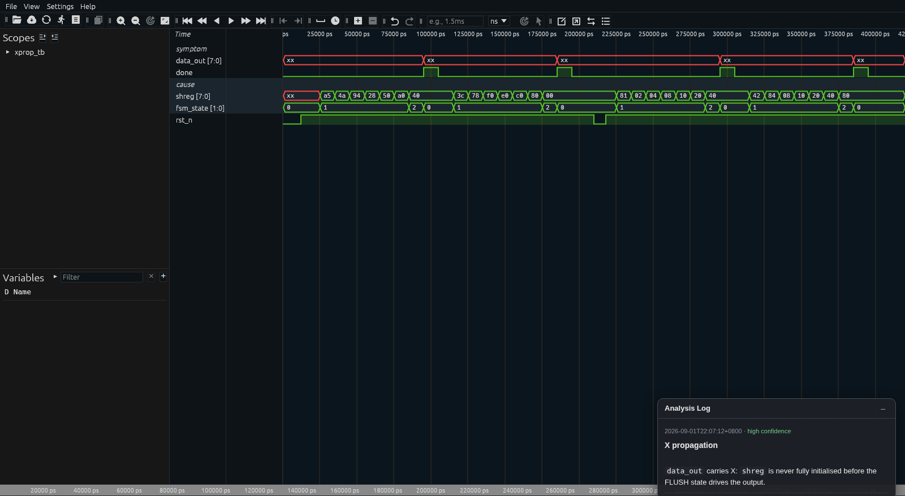
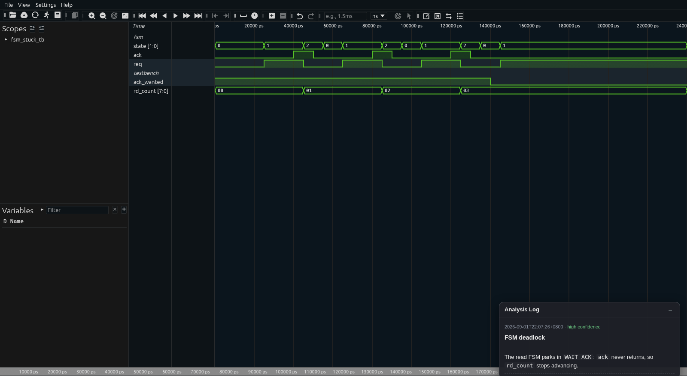
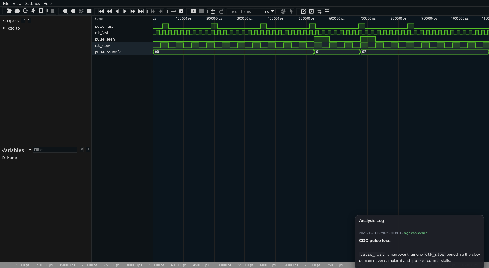
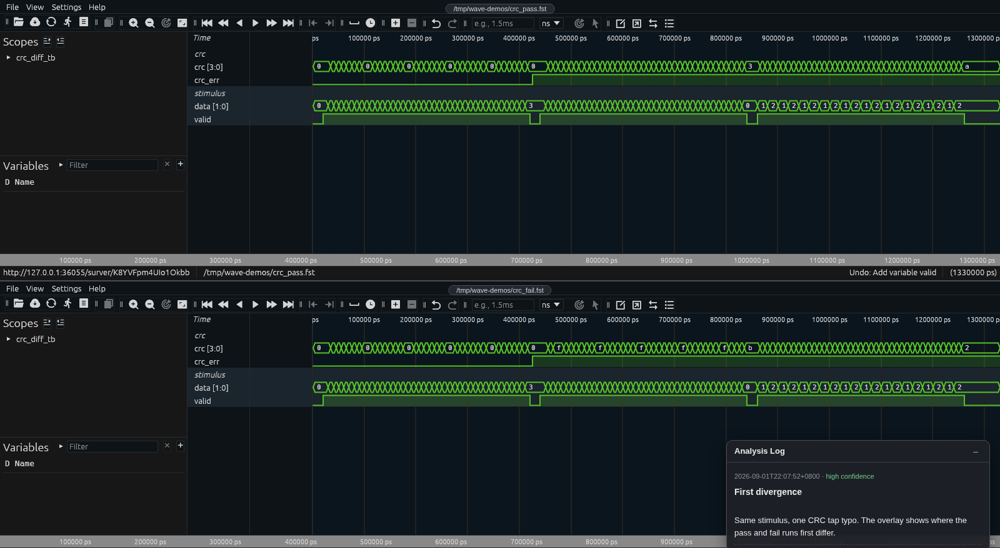

# Wave viewer screenshots

What the browser viewer actually looks like when an agent finishes an
analysis and presents it. Every image below is a real capture of the four
demo scenarios in [examples/viewer_demos](../examples/viewer_demos), not a
mockup: signal groups, bus formatting, colors and the Analysis Log panel are
all produced by `open_wave_view` / `update_wave_view`.

The debug reasoning behind each scenario (which tool call found what) is
written up in the [demo README](../examples/viewer_demos/README.md). This page
is only about what you see.

## X propagation

`data_out` is red and reads `xx` on every packet, while `done` keeps pulsing:
the FSM is healthy but the datapath is poisoned. Grouping puts the symptom on
top and the cause below, where `shreg` is shown in hex and never leaves X on
its high byte. The Analysis Log in the corner carries the agent's conclusion
with a confidence tag.



## FSM deadlock

`state` flatlines at `1` (`WAIT_ACK`) while `ack_wanted` stays high and
`rd_count` freezes at `03`. The `fsm` and `testbench` groups separate the
stuck handshake from what the testbench expected.



## CDC pulse loss

Six pulses go out on `pulse_fast` in the fast domain, only two survive into
`pulse_seen`, and `pulse_count` stops at `02`. Grouping by clock domain makes
the loss obvious: the source pulse is narrower than one `clk_slow` period, so
the slow domain simply never samples it.



## Pass/fail divergence

Two waveforms, one pane each, time-aligned. Same RTL and same stimulus, one
CRC tap typo. `crc` tracks identically until it splits (`3` / `a` on top,
`f` / `b` below) and `crc_err` rises only in the failing run. This is the view
`diff_waveforms` sets up for first-divergence localization.



## Reproduce these yourself

Everything here is reproducible from a clean clone. Build the demo waveforms
once, then either capture the images again or open any scenario interactively.

Prerequisites: `iverilog` and `vcd2fst` on PATH, plus the viewer extra
(`pip install -e ".[viewer]"`, or set `WAVE_MCP_VIEWER_ASSETS`).

```bash
cd examples/viewer_demos
./make_all.sh                 # iverilog -> vcd2fst -> build_session
```

To regenerate every screenshot on this page (needs `playwright` and its
chromium: `pip install playwright && playwright install chromium`):

```bash
python3 examples/viewer_demos/capture_screenshots.py
python3 examples/viewer_demos/capture_screenshots.py cdc   # just one
```

Images are written to `docs/images/viewer/`. The script runs chromium headless,
waits for the Surfer WASM canvas to paint, and skips cleanly (exit 0) when
playwright or the viewer assets are missing.

To poke at a scenario by hand instead of looking at a static image, run a demo
with `--hold` and open the URL it prints:

```bash
python3 examples/viewer_demos/demo3_cdc.py --hold
```

Or open the prebuilt waveforms directly, without the scripted annotations:

```bash
wave-view examples/viewer_demos/waves/cdc.fst \
    --signals cdc_tb.dut.pulse_fast cdc_tb.dut.pulse_seen cdc_tb.dut.clk_slow
```

On a remote machine, forward the port the viewer prints
(`ssh -L 8080:127.0.0.1:<port> <host>`) and open the URL locally. See the
[wave viewer guide](WAVE_VIEWER.md) for the full CLI and tool reference.
