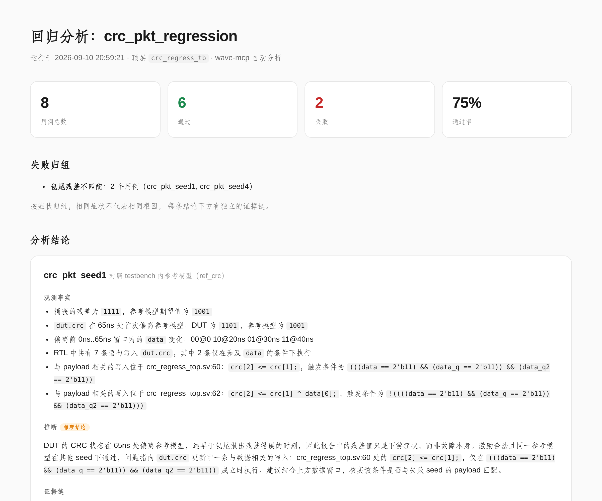
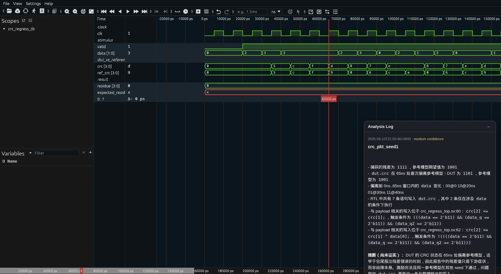

# 回归自动分析

用一条命令完成回归跑批、失败定位和带波形截图的报告生成，展示 wave-mcp 在真实回归场景下的分析能力。

```bash
./run_demo.sh
open report/index.html
```

## 产出

报告首屏：通过率、按症状归组的失败清单，以及每个失败用例的观测事实、推断和证据链。



每条结论配一张波形截图。下图中 `crc`（红）和 testbench 参考模型 `ref_crc`（绿）在 65ns 之前逐拍一致，到游标标记处分叉：`d` vs `9`。这就是结论所依赖的事实，看图即可判断。



## 展示什么

```
run_regression.py          triage.py
  iverilog + vvp             wave-mcp 分析
  逐 seed 仿真         ->    波形 + 网表查询         ->   report/index.html
  regression.json            viewer + 截图                 shots/*.png
```

重点在第二个箭头。读清单、统计通过率谁都会做；从"seed 1 挂了"推到"第 60 行的写入只在特定 payload 模式下触发"，这才是工程师平时一个下午一个 failure 的工作量。

## 两个阶段

`run_regression.py` 是你项目里已有的部分。它对每个 seed 编译、仿真，然后写 `runs/regression.json`：用例 ID、seed、状态、原因、日志路径、波形路径。不做任何分析。同一份 RTL 大多数 seed 通过、少数失败，因为 bug 需要特定 payload 模式才触发，payload 由 seed 决定，哪些 seed 失败由仿真器裁定。

`triage.py` 是 wave-mcp 提供的能力。对每个失败用例：

1. 用 `prepare_session` 打开该用例自己的波形
2. 读取实际捕获的残差和参考模型的期望值
3. 逐拍比较 `dut.crc` 与 testbench 的 `ref_crc`，定位 DUT 首次偏离参考模型的时刻
4. 提取偏离前的 `data` 总线变化窗口
5. 用 `signal_drivers` 查询哪些语句写入 `dut.crc`，其中哪些受 `data` 相关条件守护
6. 打开 viewer 停在偏离点，截图，写报告

## 报告内容

每个失败分三块呈现，不混为一谈：

- 观测事实：确定性的工具输出，信号值、时间、源码位置、守卫条件
- 推断：明确标注为推理结论，只说"去哪看、为什么"，不说"这就是 bug"
- 证据链：每条事实背后的实际工具调用，可复核

配上波形截图（停在偏离点），以及 viewer 的交互链接（进程存活时可用）。

## 诚实边界

- 相同症状只报为症状归组，不宣称相同根因。证明共因需要逐用例证据，因此每条结论带独立证据链。
- "首次偏离"证明 DUT 从此处开始与参考模型不一致，不能仅凭此确定是哪行代码出错。驱动查询缩小到候选语句，推断说明了这一点。
- 脚本不读 RTL 注释里的预设答案。修掉 bug 就零失败、无需分析；换个 bug，报告里的行号和条件随之改变。
- 交互链接随进程退出失效，静态报告和截图不受影响。

## 前置依赖

| 依赖 | 用途 |
| --- | --- |
| `iverilog`、`vvp` | 运行回归仿真 |
| `vcd2fst` | 转换波形（也可以把 VCD 直接传给 wave-mcp） |
| wave-mcp 可导入 | 分析 |
| playwright + chromium + viewer 资产 | 仅截图需要 |

没有浏览器时加 `--no-shots`：分析和报告照常生成，每条结论链接到 viewer 而非嵌入图片。

## 文件说明

```
rtl/crc_regress_top.sv    带 payload 相关 CRC 缺陷的 DUT + 参考模型
rtl/crc_regress.f         网表用 filelist
run_regression.py         阶段 1：仿真，记录结果
triage.py                 阶段 2：分析，截图，生成报告
run_demo.sh               一条命令跑完两个阶段
capture_docs_screenshots.py  刷新文档用的两张截图
runs/                     生成物：逐用例波形、日志、清单
report/                   生成物：index.html + shots/
```

上方两张截图存放在 `docs/images/viewer/`，修改 demo 后执行以下命令刷新：

```bash
./run_demo.sh
python3 capture_docs_screenshots.py
```

## 接入你自己的回归

`triage.py` 读取 `runs/regression.json`。改成指向你自己的清单（保持 `case_id`、`seed`、`status`、`reason`、`waveform` 字段），调整文件顶部的信号名即可。分析流程本身是通用的：拿 DUT 与 testbench 已有的参考信号逐拍比较，找到首次偏离，再查网表中是什么驱动了出错的信号。
